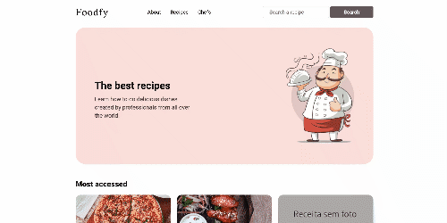

    

Status: Em desenvolvimento!!!!!

# foodfy
Aplicativo MVC para explorar, gerenciar receitas e chefs - construído com Express, Nunjucks e Postgres

Leve suas habilidade de culinária para outro nivel. Explore suas habilidades.

 

## :memo: Licença

Esse projeto está sob a licença MIT. Veja o arquivo [LICENSE](/LICENSE) para mais detalhes.

---

Feito com :purple_heart: by [Dheyme Sena](https://www.linkedin.com/in/dheyme-sena/)
